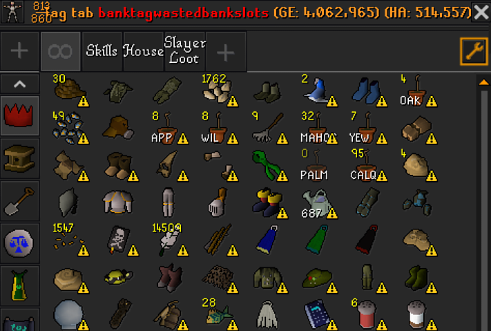
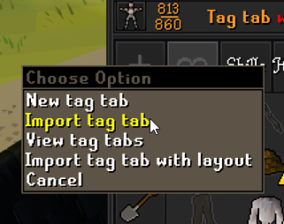

# osrs-wasted-bank-space-tag-tab

## What is

This is a terrible script that parses [mcgeer/WastedBankSpace](https://github.com/mcgeer/WastedBankSpace)'s source code to generate a bank tag string compatible the RuneLite clients' tag tabs.


## How to use in RuneLite

- Navigate to [this link](https://raw.githubusercontent.com/Makeshift/osrs-wasted-bank-space-tag-tab/master/generated-tab.txt) for the most recent generated version.
- Copy the entire thing
- Open your bank in OSRS, right click the `+` button at the top left and select `Import tag tab`


## Development / Manual Generation

To install dependencies:

```bash
bun install
```

To run:

```bash
bun run index.ts
```
